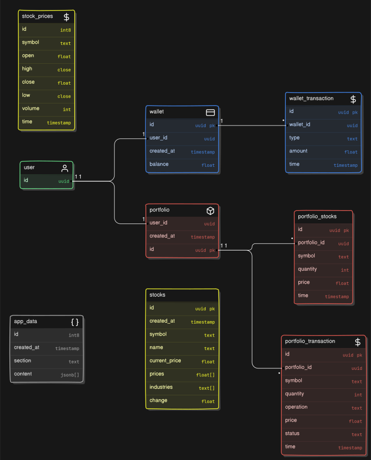

# FinTrack

  

## What is FinTrack?

FinTrack at its core is a simple paper trading and portfolio management app geared towards beginners. Its sole aim is to teach you the basic fundamentals of the stock market without having to risk a single dime. Whether you're new to investing or looking to refine your skills, FinTrack provides the tools you need to make informed decisions without risking your hard earned dollars.

It is completely free to use for educational purposes. All stocks and currency displayed withing the app are fake and for demonstration purposes only.

## Getting started

### Creating an Account

Go to the `Signup` page to create an account. Enter your name, email address and password. Please try to enter accurate information.

### Logging in

To log back into an existing account visit the `Login` page.

### Adding money

To add virtual money to your wallet, go to the `Wallet` page and click on the `Add money` button. A dialog will popup. Enter the amount of money that you want to deposit to your wallet and click `Add`.

The amount will then be deposited to your account. Remember though that this is only fake money.

### Withdrawing Money

To withdraw money from your wallet, in the `Wallet` page, click on the withdraw money button and then repeat the same steps as above. This time instead click on the `Withdraw` button. the virtual money will then be withdrawn from your account.

### Buying Shares

To buy shares, go to the `Invest` page and select on the name of the share that you want to purchase. You will then be redirect to the `stock` page. Here you can see basic fundamentals of the share, like its full name, symbol (ticker), growth and stock performance metrics.

To buy shares, look at the `Order` card. Make sure the tab option is set to `Buy`. Now select the number of shares you want to purchase. Ensure that your wallet has enough balance to purchase those many shares. Then finally click on the `BUY NOW` button.

Your purchase will then be initiated and will either succeed and very rarely fail. Upon success, u’ll see those shares reflected upon your `portfolio` and the amount will be deducted from your wallet. If the transaction fails, your funds will be kept safe.

### Selling Shares

Selling shares is almost very similar to Buying shares. This time just set the option to `Sell` in the order card instead of `Buy`. Then click on the `SELL NOW` button. Do ensure that you have enough quantity of shares before selling. Otherwise, the transaction won’t proceed.

Upon completion of the transaction, the shares will be sold and the amount equivalent to the current value of those shares will be credited back into your account. You can also notice this change on your `portfolio` page.

## Features

- **Portfolio Management:** Easily track and manage your stock investments in one place.
- **Paper Trading:** Simulate real-world trading without financial risk.
- **User-Friendly Interface:** Navigate through the app effortlessly with a clean and intuitive design.
- **Virtual wallet** - Add and withdraw money from your virtual wallet with real feel.
- **Detailed Portfolio** - Get access to a detailed portfolio page that shows all metrics of your portfolio in detail.
- **FIFO Stock Sales**: Stocks are sold using the First-In-First-Out (FIFO) method, ensuring that older stocks are sold before newer ones.

## Tech stack

FinTrack is built primarily with `React` to ensure fast reload times and responsiveness. It uses `NextUI` library components for a minimalist and consistent design language.

### Here’s the detailed stack:

- **Frontend** - `React` , `Tailwind CSS` with `Next UI` components
- **Bundler** - `Vite`
- **Deployment** - `Vercel`
- **Backend** - All backend services include `auth`, `db`, `storage`, `real-time subscriptions` are handled by `Supabase` through it’s PostgreSQL db.
  `SQL queries` are executed directly through `Supabase` to manage specific operations on the database tables, such as wallet transactions, stock transactions, and portfolio management, etc.

Here’s the entire data model used for this app:

  

## Reach out to me

For any support, feedback, or collaboration, feel free to reach out:

- **Email**: nirmalyamallickthakur@gmail.com
- **Twitter**: [https://x.com/its_nmt05](https://x.com/its_nmt05)
- **GitHub**: [https://github.com/its-nmt05](https://github.com/its-nmt05)

We are always open to add new exciting features to the app and make FinTrack better!
