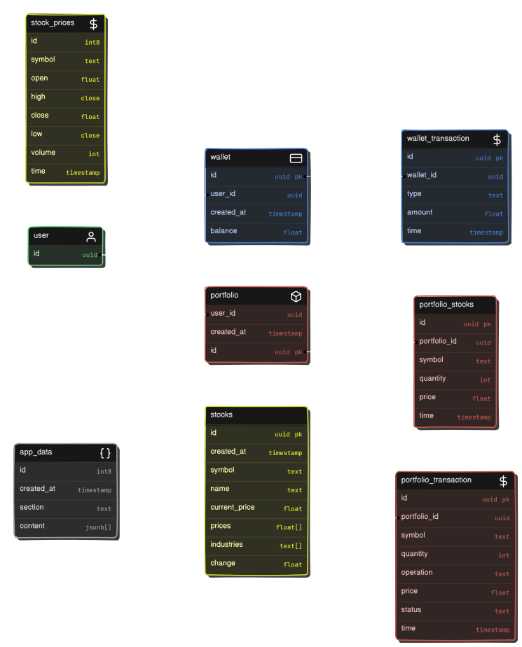

# FinTrack

  

## What is FinTrack?

FinTrack at its core is a simple paper trading and portfolio management app geared towards beginners. Its sole aim is to teach you the basic fundamentals of the stock market without having to risk a single dime. Whether you're new to investing or looking to refine your skills, FinTrack provides the tools you need to make informed decisions without risking your hard earned dollars.

It is completely free to use for educational purposes. All stocks and currency displayed withing the app are fake and for demonstration purposes only.

## Features

- **Portfolio Management:** Easily track and manage your stock investments in one place.
- **Paper Trading:** Simulate real-world trading without financial risk.
- **User-Friendly Interface:** Navigate through the app effortlessly with a clean and intuitive design.
- **Virtual wallet** - Add and withdraw money from your virtual wallet with real feel.
- **Detailed Portfolio** - Get access to a detailed portfolio page that shows all metrics of your portfolio in detail.
- **FIFO Stock Sales**: Stocks are sold using the First-In-First-Out (FIFO) method, ensuring that older stocks are sold before newer ones.

## Tech stack

FinTrack is built primarily with `React` to ensure fast reload times and responsiveness. It uses `NextUI` library components for a minimalist and consistent design language.

### Here’s the detailed stack:

- **Frontend** - `React` , `Tailwind CSS` with `Next UI` components
- **Bundler** - `Vite`
- **Deployment** - `Vercel`
- **Backend** - All backend services include `auth`, `db`, `storage`, `real-time subscriptions` are handled by `Supabase` through it’s PostgreSQL db.
  `SQL queries` are executed directly through `Supabase` to manage specific operations on the database tables, such as wallet transactions, stock transactions, and portfolio management, etc.

Here’s the entire data model used for this app:

  

## Reach out to me

For any support, feedback, or collaboration, feel free to reach out:

- **Email**: nirmalyamallickthakur@gmail.com
- **Twitter**: [https://x.com/its_nmt05](https://x.com/its_nmt05)
- **GitHub**: [https://github.com/its-nmt05](https://github.com/its-nmt05)

We are always open to add new exciting features to the app and make FinTrack better!
